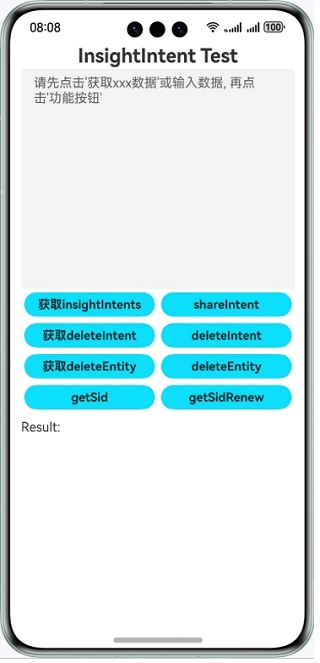
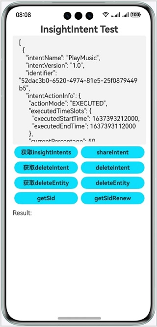
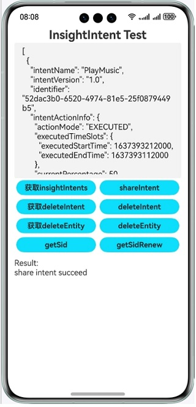
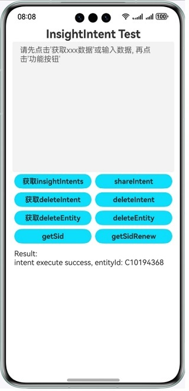
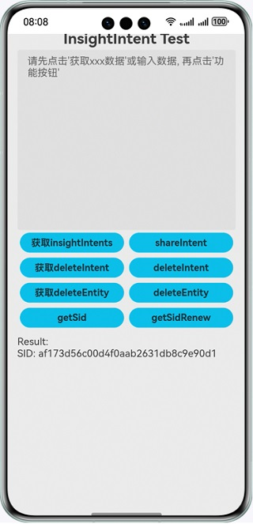

# 意图框架

## 介绍
- 本示例基于意图框架，使用`@kit.IntentsKit`实现意图共享，使用`@kit.AbilityKit`的`InsightIntentExecutor`实现意图调用。

## 效果预览

### 意图共享
1. 共享界面展示。

   

2. 按`获取insightIntents`获取insightIntent示例数据，获取的示范数据将显示在共享界面上方输入框内。

   

3. 按`shareIntent`进行数据共享，并在共享界面下方的结果栏内获取意图共享结果。

   

### 意图调用

- 待共享的意图完成处理后，将会在小艺建议的卡片内展示共享的意图，点击展示的对应卡片，执行意图调用逻辑。

#### 使用小艺建议模板卡片实现意图调用
1. 小艺建议展示模板卡片，此项目内使用音乐类模板卡片。

   

2. 点击模板卡片，按照意图注册配置内逻辑，执行对应跳转。此项目内跳转至共享界面，并在共享界面下方结果栏内展示意图调用回传参数。

   

### SID获取
1. 点击`getSid`获取SID，并在结果栏内展示（优先获取缓存）。

   

2. 点击`getSidRenew`强制获取新的SID，并在结果栏内展示。

   

## 工程目录
```
entry/src/main/
| --- ets
|     | --- entryability
|     |     | --- EntryAbility.ets                                  // 共享界面Ability
|     |     | --- InsightIntentExecutorImpl.ets                     // 意图调用逻辑
|     | --- pages
|     |     | --- Index.ets                                         // 共享界面UI
|     | --- utils
|     |     | --- FileReader.ets                                    // 意图示例数据文件读取
|     |     | --- InsightIntentSharer.ets                           // 意图共享与getSid API调用
|     |     | --- Logger.ets                                        // 日志打印
| --- resources
|     | --- base
|     |     | --- profile
|     |     |     | --- insight_intent.json                         // 意图注册配置
|     |     |     | --- main_pages.json                             // 应用界面列表
|     | --- rawfile
|     |     | --- config
|     |     |     | --- deleteEntity.json                           // API删除实体数据示例
|     |     |     | --- deleteIntent.json                           // API删除意图数据示例
|     |     |     | --- shareIntent.json                            // API共享意图数据示例
```

## 具体实现

意图共享在InsightIntentSharer中实现，源码参考InsightIntentSharer.ets。
- 意图共享：首先创建insightIntent.InsightIntent数据实体，接着使用insightIntent.shareIntent共享意图数据，最后通过Promise或callback执行共享后的逻辑。

意图调用在InsightIntentExecutorImpl中实现，源码参考InsightIntentExecutorImpl.ets。
- 意图调用：重写onExecuteInUiAbilityForegroundMode方法，通过参数name确认调用意图名，通过参数param获取调用意图数据。

## 相关权限

### 依赖
1. 本示例依赖@ohos/hvigor-ohos-plugin，且最低版本为4.3.0。
2. 使用DevEco Studio版本大于本示例推荐版本，请根据 DevEco Studio 提示更新 hvigor 插件版本。
3. SID获取需联网、登录华为账号并同意小艺建议的用户协议和隐私政策。

### 约束与限制
1. <font>**意图共享和意图调用的测试，当前无法由开发者独立完成，烦请根据Intents Kit接入流程，通过邮箱向华为意图框架接口人提交验收申请，由接口人配合开发者一同完成测试验收。**</font>
2. 本示例仅支持标准系统上运行，支持设备：华为手机、华为平板。
3. HarmonyOS系统：HarmonyOS NEXT Developer Beta1及以上。
4. DevEco Studio版本：DevEco Studio NEXT Developer Beta1及以上。
5. HarmonyOS SDK版本：HarmonyOS NEXT Developer Beta1 SDK及以上。
